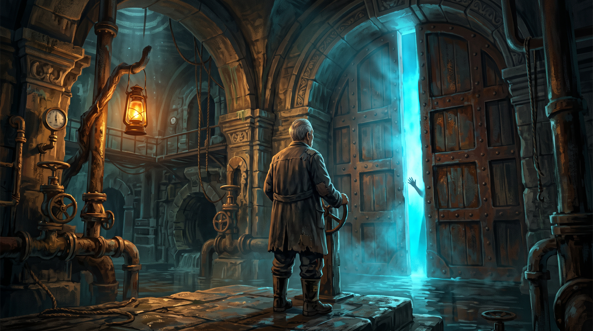

# 门下有潮声｜网页游戏 Demo

《门下有潮声》是一款以“两层巴别塔”为背景的单人叙事解谜游戏原型。玩家扮演守门二十七年的旧渠值守人梁顺，从一组不可能成立的水位数据开始，逐步发现石门另一侧并非无人废渠。



## 当前版本

- 纯前端网页 Demo，无需后端服务。
- 四幕浓缩流程，包含环境调查、物品交互、节奏沟通、湿页拼合、语言破译、据点养成和救灾协同。
- 第一幕使用预渲染 360° 岗房贴图，可连续环顾并搜寻调查热点。
- 第一幕采用全屏密室 HUD，包含逐件搜寻、水表灯光校准、双图叠合和机械密码锁。
- 翻牌、湿页排序、语言词卡和共钟信号使用每轮独立的随机种子。
- 支持桌面浏览器和移动端触屏。
- 单次完整体验约 20 分钟。

## 核心命题

> 玩家先亲手维持“门必须关闭”的秩序，再用同一套工作经验发现，这套秩序一直在说谎。

四幕拥有不同的小游戏形式，但共享同一组核心行为：

1. 观察环境与异常数据。
2. 留下记录并组合证据。
3. 与无法直接互通语言的人验证信息。
4. 利用双方各自掌握的半套知识协同操作。

## 四幕内容

### 第一幕《水位正常》

- 环顾岗房并调查水表、值守桌、墙图、隐藏铁柜和石门。
- 在场景中取得听潮筒、灯油、检样钩等物品。
- 通过物品与热点的组合建立线索前置关系。
- 根据证据在旧图上追踪被删除的真实水路。

### 第二幕《门后有人》

- 逐组回应“三下、两下、一下”的人工报码。
- 依照“先热、再油、后轻敲”的维护经验打开观察孔。
- 拼合赵川留下的湿册，确认官方记录存在矛盾。

### 第三幕《先听懂名字》

- 体验三个钟日的门槛据点生活。
- 小满拥有自己的行动计划，玩家选择如何参与，而不是替她安排日程。
- 通过十二张随机沉渣翻牌和双语境验证建立共享词典。
- 翻牌记录步数与连续配对，完成效率会改变获得的工料数量。
- 建设安全绳道、听钟管或植物滤槽，并影响第四幕路线。

### 第四幕《同声》

- 在上涨潮线的压力下调查旧泵站、界壁档案室与联合水门。
- 第三幕设施会改变可用路线和救灾成本。
- 通过共钟完成三个节点的同步操作。
- 选择不会阻断主线，但会改变最终物资损失和记录内容。

## 操作方式

| 操作 | 桌面端 | 移动端 |
|---|---|---|
| 环顾岗房 | 按住拖动、滚轮或方向键 | 单指拖动 |
| 调查热点 | 点击发光标记 | 点击标记 |
| 选择物品 | 点击腰包物品 | 点击腰包物品 |
| 关闭近景 | 点击右上角关闭按钮 | 点击关闭按钮 |
| 重新开始 | 顶部回转按钮 | 顶部回转按钮 |
| 切换声音 | 顶部音符按钮 | 顶部音符按钮 |

游戏进度保存在浏览器 `localStorage` 中。

## 技术实现

- HTML、CSS 与原生 JavaScript。
- 无运行时框架和第三方前端依赖。
- 360° 场景采用 2:1 等距柱状投影贴图、循环背景与动态热点投影。
- 音效由 Web Audio API 实时合成。
- 随机小游戏使用可复现的本轮种子，读取存档后不会无故改变牌序。
- 布局针对桌面和移动端分别适配。

## 项目结构

```text
.
├── index.html
├── styles.css
├── game.js
└── assets/
    ├── workshop-panorama.png
    ├── key-art.png
    ├── tower-cg.png
    ├── xiaoman-sheet.png
    ├── xiaoman-sheet-alt.png
    └── props-sheet.png
```

## 美术资产

- `workshop-panorama.png`：岗房 360° 全景贴图。
- `key-art.png`：封面与开门场景主视觉。
- `tower-cg.png`：第三幕幕末的穹城揭示 CG。
- `xiaoman-sheet.png`：小满六种表情差分。
- `props-sheet.png`：听潮筒、蓝灯、赵川册等物品立绘。

当前美术为原型阶段的 AI 辅助生成素材，正式制作时仍需统一角色设定、投影精度、物件比例和场景连续性。

## 设计原则

- 沟通先于翻译，不使用万能翻译器跳过理解过程。
- 错误提供新的语境和反馈，不制造永久卡关。
- 小满是主动执行任务的调查搭档，不是等待玩家管理的养成对象。
- 不把语言差异写成灾难；真正的问题是禁止接触、翻译和协商。
- 第四幕采用有追逐压力的调查闯关，而不是脱离叙事的随机刷怪肉鸽。

## 当前限制

- 这是验证叙事结构与交互方向的垂直切片，并非完整四幕内容。
- 全景场景仍使用单张预渲染贴图，不包含自由行走、碰撞或真实三维光照。
- 对话、养成周期、可调查物件和第四幕路线数量仍需要扩充。
- 尚未加入完整配音、背景音乐、手柄操作与独立存档槽。

## 状态

原型持续迭代中。
